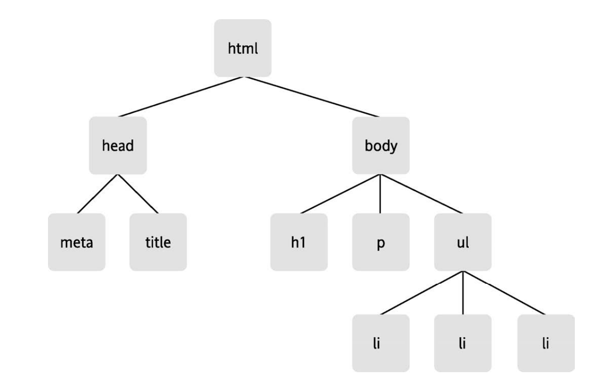
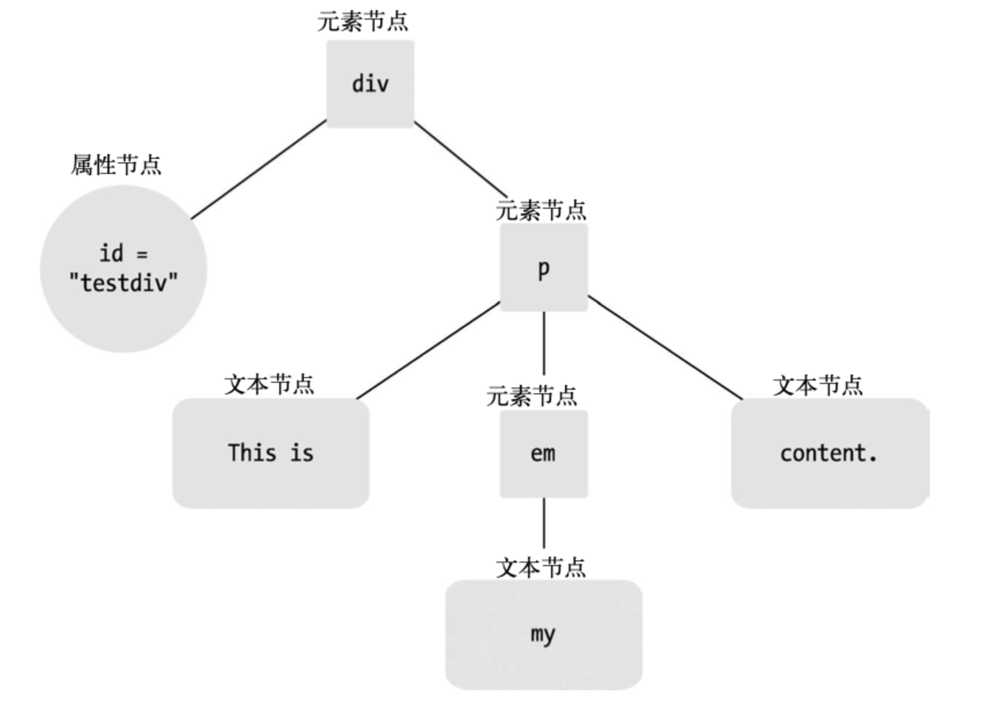
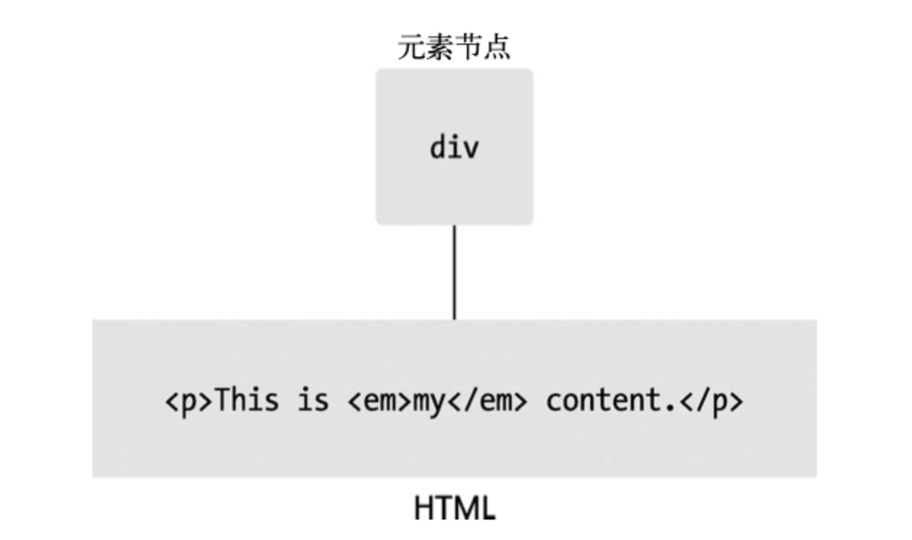
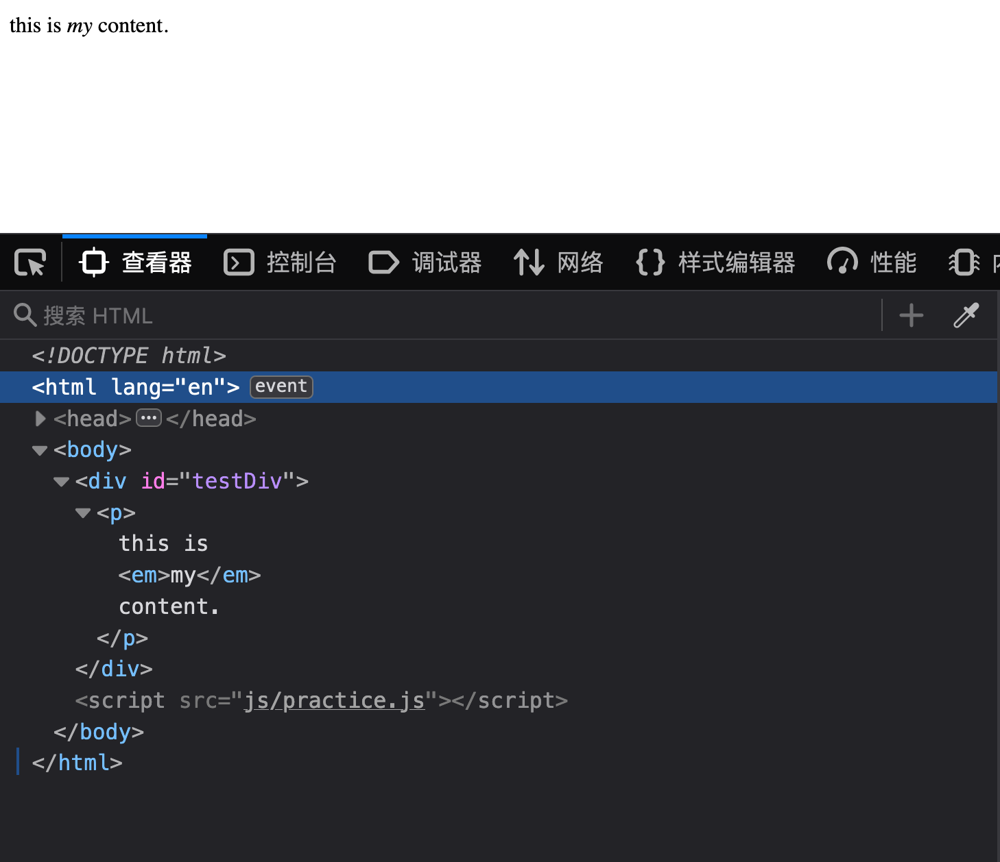

# JavaScript DOM编程艺术 笔记

---

>[JavaScript DOM编程艺术中的demo源代码](https://github.com/Meakle/dom_scripting_demo)

## DOM

### D

document文档

### O

object 对象

JavaScript的对象分为三种
* 用户定义对象（user-defined-object），就是我们自己创建的对象
* 内建对象（native object），JavaScript自带的对象，Array，Math
* 宿主对象（host object），由浏览器提供的对象

### M
Model 模型

DOM把一份文档表示为一棵树，网页中有的元素有父元素，子元素，兄弟元素。

比如说下图：



我们可以将文档的各种元素想象成一颗数，将文档称之为“节点树”

### 节点

节点（node），在DOM中有许多的节点。如上图所示

#### 元素节点

元素节点（element节点）

在上图中`head`是一个节点，`ul`无序列表也是一个节点，`html`也是一个节点，他是节点树的根元素

#### 属性节点

属性节点（attribute node）

属性节点用来对元素做出更具体的描述

**注意：属性是包含在html标签中的`<p id = "xx"></p>`**

#### 文本节点

文本节点（text node）

`<p>就这？</p>`里面的文本“就这”就是一个文本节点

**注意：文本节点是包含在html标签里面的**

### 获取元素

有三种方法可以获取元素节点（element node），分别是通过ID，标签名，类名获取

* document对象特有的函数

#### getElementById

* 语法`document.getElementsById('ID')`
* 返回值：返回一个对象，在document对象中仅有的元素（ID是唯一的）

#### getElementByTagName

* 语法`document.getElementByTagName('tag')`
* 返回值：返回一个对象数组，其中的对象是文档中被选中的标签（具有相同标签名）

小练习：如果只想知道` id `属性值是` purchase `的元素包含着多少个列表项，该如何写

```js
let arr = document.getElementById('purchase').getElementsByTagName('*');

alert(arr.length);

```
tips：`*`是通配符，一点要加上引号，和乘法符号做区别 

#### getElementByClassName

* 语法`document.getElementsByClassName('class')`
* 返回值：具有相同类名元素的数组

### 获取和设置属性

获取和设置属性的方法不属于document，只能用过元素节点对象调用。

#### getAttribute

* 语法`object.getAttribute('属性')`
* 返回值：这个object（元素节点/对象）的属性值

#### setAttribute

* 语法`object.setAttribute('属性', 需要设置的属性值)`
* 如果没有该属性值，那么我们创建一个，如果有该属性值，我们覆盖掉之前的

### 检索和修改文本节点

首先我们要注意到一点，文本节点是**不包含**在元素节点里面的，所以当我们需要修改文本节点的时候，我们要通过元素节点，然后选择元素节点的子节点修改。

#### 获取元素的所有子元素 ——childNodes属性

* 语法：`element.childNodes`
* 返回值：数组

我们要注意的是这个属性所返回的是所有的节点，在文档树中不仅仅包含元素节点，事实上在文档中几乎每一样东西都是一个节点，空格和换行符都会被解释为节点，而他们全都包含在childNodes属性所返回的数组中。

我们可以使用`nodeType`来获取节点的nodetype属性

nodeType 属性总共有 12 种可取值，但其中仅有 3 种具有实用价值。
 元素节点的 nodeType 属性值是 1。
 属性节点的 nodeType 属性值是 2。 
 文本节点的 nodeType 属性值是 3。

#### firstChild和lastChild属性

两个等价写法
`element.childNodes[0] = element.firstChild`
`element.childNodes[element.childNodes.legth - 1] = element.lastChild`

#### 结合childNodes修改文本节点

* `nodeValue`
* 作用：得到或者设置一个节点的值
* 性质：属性

例子：`<p id="description"> Choose on image.</p>`

```js

let description = document.getElelmentById('description');

// 这里取到的值是空值，因为在<p>标签中没有文本元素，文本元素是其子元素
// description.nodeValue;

// 正确写法

// 获取
alert(description.childNodes[0].nodeValue);//choose on image.

// 设置
description.firstChild.nodeValue = 'xxx';


```

---
## JavaScript和HTML代码分离

在上面学习的过程中我们在HTML界面中使用了`onclick()`，这是一个事件处理函数，我们应该将JavaScript代码和HTML代码分离。

### 使用匿名函数调用onclick函数

```js

object.onclick = function (){

    //function body

}

```

当我们点击`object`这个元素节点的时候，我们就会调用后面匿名函数里面的操作

具体demo请看chapter4和chapter6的区别

---

## 共享onload事件

网页在加载完成之后会触发一个onload事件，这个事件与Windows对象相互关联

### onload事件的使用方法

* 将一个函数绑定在onload上
  ```js

    windows.onload = xxx; //xxx为一个函数

  ```

现在我们就将一个函数绑定在了onload上

* 将多个函数绑定在onload上
  ```js

    Windows.onload = function() {
        xxx;//函数
        sss;//函数
    }

  ```

这种方法使用了匿名函数，很方便，不过有个更骚的——addLoadEvent

方法步骤：

1. 把现有的 window.onload 事件处理函数的值存入变量 `oldonload`。
2. 如果在这个处理函数上还没有绑定任何函数，就像平时那样把新函数添加给它。
3. 如果在这个处理函数上已经绑定了一些函数，就把新函数追加到现有指令的末尾。

```js

function addLoadEvent(func) {
    let oldonload = windows.onload();

    if(typeof windows.onload != 'function'){

        windows.onload = func;

    } else {

        wimdows.onload = function () {

            oldonload;
            func;

        }

    }

}

```

在页面加载完毕之后执行的函数创建一个队列，如果还想添加函数进去，我们只需要使用以下代码即可

`addLoadEvent(firstFunction)`

`addLoadEvent(secondFunction)`

## DOM Core 和 HTML-DOM

转载：

> ### 什么是DOM？
>
> DOM （Document Object Model文档对象模型）是 W3C（万维网联盟）的标准。
>
> DOM 定义了访问 HTML 和 XML 文档的标准：
>
> >  “W3C 文档对象模型 （DOM） 是中立于平台和语言的接口，它允许程序和脚本动态地访问和更新文档的内容、结构和样式。”
>
> W3C DOM 标准被分为 3 个不同的部分：
>
> - 核心 DOM - 针对任何结构化文档的标准模型
> - XML DOM - 针对 XML 文档的标准模型
> - HTML DOM - 针对 HTML 文档的标准模型

### 二者的区别

说白了DOM Core是核心，而HTML-DOM是DOM Core的扩展。

HTML——DOM定义了一些方法，使得我们调用DOM更加的方便

等对于DOM Core的写法掌握了以后再学习HTML-DOM，现在学习我怕混淆

---
## 动态创建标记

### 传统方法介绍

#### document.write

例子 `document.write('<p>this is inserted.</p>')`

结果：我们可以直接在web浏览器中看见这一行


#### innerHTML属性

该属性能用来读、写某给定元素中的HTML内容。

```html

<div id="testDiv">

    <p>
      this is <em>my</em> content. 
    </p>

</div>

```

如果使用DOM的眼光来看待上述代码的话应该是如此的




如果我们使用DOM来进行访问的话，我们可以对这个DOM树种的所有节点进行访问，然而使用innerHTML属性来说的话，将会简单的多



该属性的优点：

当我们需要将一大段东西放进去的时候这就是一个很方便的方法：
```js

window.onload = function(){

  let testDiv = document.getElementById('testDiv');
  testDiv.innerHTML = ' <p>this is <em>my</em> content. </p>'

}

```

审查元素的结果如下




注意： 

* 一旦使用`innerHTML`这个方法我们无法区分`插入一段HTML内容`还是`替换一段HTML内容`，一旦你使用了，那么该元素下的所有东西都会被替换
* `innerHTML`方法不会返回任何对刚插入的内容的引用，换句话说如果想要操作刚插入的节点，那么你还是需要使用DOM提供的方法。

### DOM方法

问题导入： 我们想要添加一个p元素节点，并且将这个节点作为div元素的一个子节点。（div元素已经有了一个子节点，那是一个id属性节点，值是`testDiv`）

结果方法：

1. 创建一个新的元素节点
2. 将创建出来的元素节点连接到DOM树上（连接到id值为`testDiv`的元素节点后）

#### createElement方法

语法：`document.createElement(nodeName)`

**作用：在文档中创建一个元素节点**

实例：步骤一的结果方案：`document.createElement('p')` 

刚刚我们说过使用`innerHTML`属性的话没有返回值，所以说我们使用`createElement`方法会有一个返回值，其返回的是这个新创建出来的元素节点的引用`let tag_p = document.createElement('p')`

`tag_p`就是该元素节点的引用

当我们创建出来了元素节点之后，并不会在浏览器中显示，因为我们并没有把这个元素节点合并到DOM树当中去，浏览器遍历了一遍DOM树没有发现我们新创建的节点。我们将这种情况称之为文档碎片（document fragment）。

不过此时该节点已经有了其相应的DOM属性

#### appendChild方法

语法：`parent.appendChild(child)`

**作用就是将一个新创建的节点插入到DOM树种的某个节点（parent）**

实例：步骤二的结果方案：`testDiv.appendChild(tag_p)`


##### tips：

我们使用插入的时候如果要插入某一个节点的子节点中，我们需要注意一下，其字节点不一定都是元素节点，因此我们如果要插入到元素节点的后面的话我们需要使用通配符将获得所有的元素节点，然后获得长度，最后再选择`长度-1`的子节点作为插入的节点

例子：书上的156页有详细的情况说明


#### createTextNode方法

语法：`document.createTextNode(text)`

**作用：在文档中创建一个文本节点**

#### insertBefore方法

语法：`parentElement.insertBefore(newElement, targetElement)`

**作用：将一个新元素插入到一个现有元素的前面**

其中我们比如告诉这个方法三件事情

* 新元素：你想要插入的元素`newElement`
* 目标元素：你想要把新元素插入到哪一个元素`tagetElement`元素之前
* 父元素：目标元素的父元素`parentElement`

我们不需要搞清楚父元素是谁，我们可以使用`Element.parentNode`这个方式来找到父元素


#### 在现有的元素后插入一个新元素

DOM中没有定义`insertAfter()`方法而这个方法需要我们自己实现。


