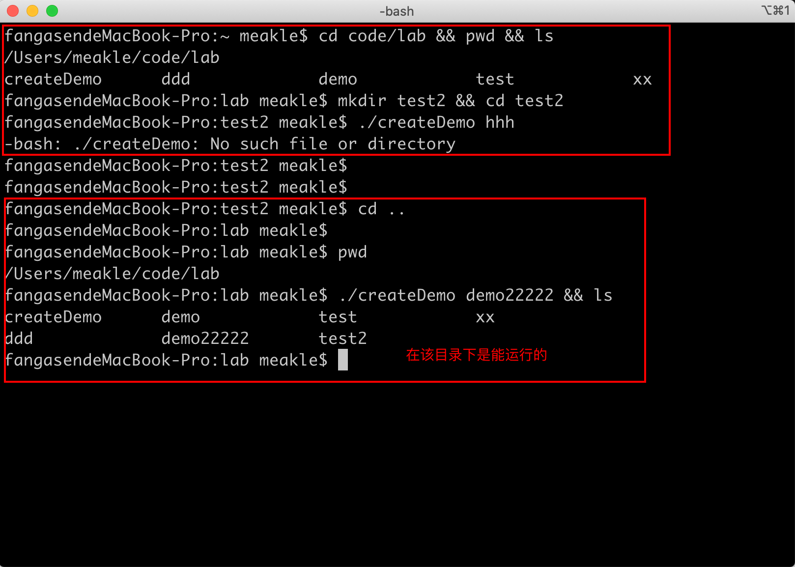

# 关于任务六——脚本文件的相关问题

问题一：脚本文件加上了`shebang`也不能直接调用

问题二：无法把脚本文件所在的目录放入环境变量中


> 运行环境：
>
> macOS 10.15.7
>
> shell：bash


## 问题一：脚本文件加上了`shebang`也不能直接调用

### 问题描述

在脚本文件中加入`shebang`，但是在终端中不能直接使用还是需要加上`./`或者`sh`才能使用


脚本内容如下：

```bash
#!/usr/bin/env sh

mkdir $1
cd $1

touch index.html
touch style.css

echo -e "<!DOCTYPE>\n <h1>head</h1>" >> index.html
```


### 期望效果

能够直接在终端中输入`cerateDemo`就能执行脚本文件中的相关指令


## 问题二：无法把脚本文件所在的目录放入环境变量中

按照如下[教程](https://xiedaimala.com/tasks/bdeeede8-0b3c-4915-9d9a-4fe039dead37/text_tutorials/9d173da0-b87a-463f-bd43-7837ebedbd3f)

> 在`~`路径下操作的

```bash
touch ~/.bashrc

echo -e "export PATH="/Users/meakle/code/lab:$PATH"" >> .bashrc
```


创建的的文件：


终端中的错误表现：




### 期望效果

能够在任意的位置使用`createDemo`这个可执行文件


## 解决方法：


在打开终端之后输入`source ~/.bashrc` 这样上面两个问题都解决了


今天在问老师问题的时候学到了一个新的命令

* `alias`

> Linux alias命令用于设置指令的别名。
>
> 用户可利用alias，自定指令的别名。若仅输入alias，则可列出目前所有的别名设置。alias的效力仅及于该次登入的操作。若要每次登入是即自动设好别名，可在.profile或.cshrc中设定指令的别名。
>
> ——[菜鸟教程](https://www.runoob.com/linux/linux-comm-alias.html)


## 注意点：

在shell当中等号两边不要加上空格，不然有可能出错。今天写脚本的时候发现的。