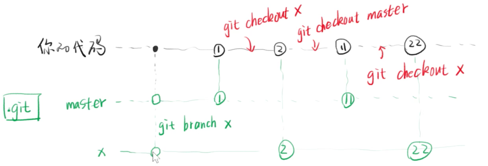

# 04_git的基本操作


```bash
git config --global user.name 你的英文名
git config --global user.email 你的邮箱
git config --global push.default simple
git config --global core.quotepath false
git config --global core.editor "code --wait"
git config --global core.autocrlf input
```

* 如果邮箱和github的邮箱不一样的话，`push`代码是没有反应的。


## 初始化

* `git init`

  将当前目录初始化为一个git仓库，并且生成一个`.git`目录

  

  目录里面会存储代码快照


`.git`目录就是本地仓库


## 添加与提交

* `git add`

  添加命令，将选中的文件，添加到暂存区（处理的是文件的变化，删除了文件也需要提交）

  ```bash
  git add index.html
  ```

* `.gitignore`

  将不提交的文件放进这个文件夹中。

  

  常见的文件有：

  * `node_modules`
  * `.DS_Store`
  * `.idea`
  * .`vscode`

* `git commit -m "xxx"`

  将暂存区的文件提交

* `git commit -v ""`

  `v`是`verbose`：冗长的，啰嗦的

## 回滚

* `git log`

  查看代码提交记录

* `git reset --hard XXXXXX`

  `xxxxxx`是提交号前六位（在git log可以查看）

  如果你没有提交（但是add了）使用了这个命令，那么这个文件会被删掉

* `git reflog`

  查看所有的提交（包括我们reset的历史）

## 分支

### 创建与切换

* `git branch x`

  创造出一个新的名为x的分支

* `git checkout x`

  切换到名为x的分支



——[图片来源——饥人谷](https://xiedaimala.com/courses/16644d89-6b17-4c2f-ac15-dabb994b7696/random/d6c7b79e0d#/common)

### 合并

* `git merge x`

  进入要保留的分支，然后与x分支合并

### 删除

* `git branch -d x`

  删除x分支

### 冲突


