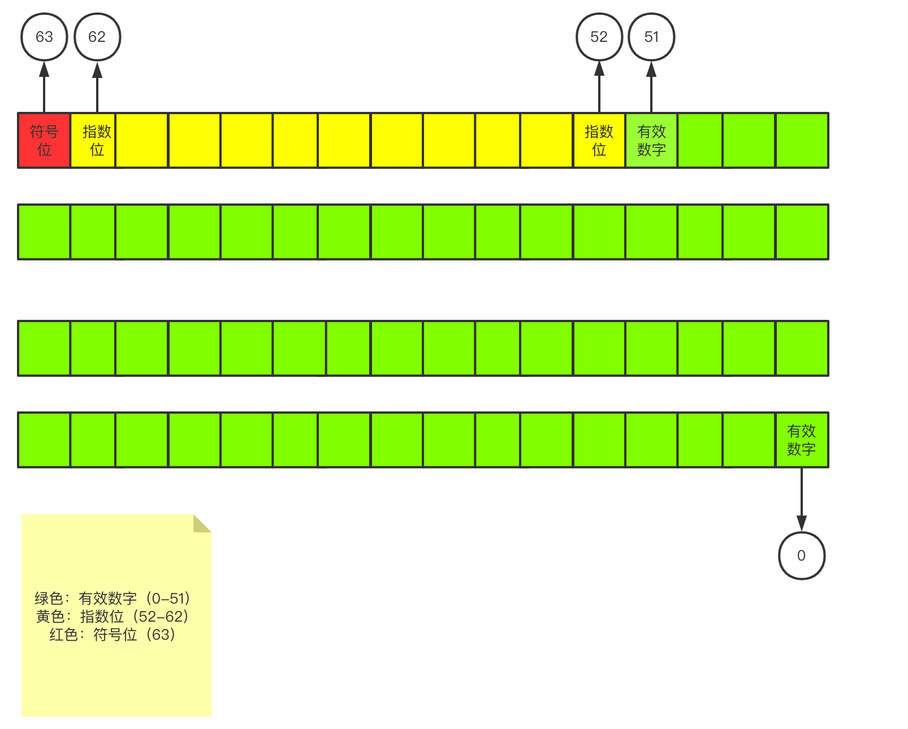

# 数据类型和运算符

## 数字与字符串

```
1 和 '1'的区别
```

一个是数字（number），一个是字符串（string）

他们存储形式不同

* 数字用64位浮点数的形式存储
* 字符串用类似UTF8的形式存储（UCS-2）

### js如何存数字

将十进制转换为二进制

但是二进制有点太长了，所以我们可以将二进制转换为16进制。


## js中的数据类型

* 数字number
* 字符串string
* 布尔Boolean
* 符号symbol
* 未定义 undefined
* 空 null
* 对象 object
* bigint


> 数组，函数，日期之类的都属于对象


### number

由64位浮点数组成。

**特殊值`0`，`-0`，`+0`**

一般来讲这几个没有区别。但是在除法的时候是有区别的。

```js
console.log(0 === -0);      //true
console.log(-0 === +0);     //true
console.log(0 === +0);      //true

console.log((-0).toString());   //0
console.log((+0).toString());   //0

let num1 = (1 / +0);
let num2 = (1 / -0);

console.log(num1 + ' ' + num2);//Infinity -Infinity
console.log(num1 === num2);//false
```

**无法表示的数字**

`NaN`

**64位空间是如何存储一个number的**

* 符号位占一位
* 指数位占11位
  * 后十位是数值位
  * 指数位的第一位是符号位
  * 因此所表示的数值是(-1023 ~ 1024)
* 有效数字占52位，开头的1省略
  * 因为用科学计数法，在任何情况都可以使开头的第一位是1，因此可以直接省略



计算公式：

```js
(-1)^符号位 * 1.xx...xx * 2^指数部分
```

可以看到数值部分，自动补了1。


### 字符串string

写法：单引号，双引号，反引号

要在引号里面写引号，使用转义字符，或者是两个引号不一样

```js
//反引号的用法
let a = `有了反引号
我就可以
像这样
换行写`;
```


**字符串的属性**

> 本来字符串是一个基本数据类相，不应该有属性。
>
> 但是这个世界魔法太多了

字符串的长度

```js
let str = '123';
let str2 = '\n';  // 注意这里是转义字符，转义之后实际上是一个字符
console.log(str.length); // 3
console.log(str2.length); // 1

// 访问字符的使用下标访问，访问的方法和数组类似
console.log(str[0]); // 1
```


### 布尔值

下面的运算符会得到bool值

* 否定运算

  ```js
  !value;
  ```

* 相等运算

  ```js
  1 == 2;
  1 != 2;
  1 === 2;
  ```

* 比较运算

  ```js
  1 > 2;
  1 >= 2;
  ```


**五个falsy值**

falsy值相当于false但是又不是false的值，也就是说使用转型函数`boolean()`得出来的是false的值

* `undefined`
* `null`
* ` ''`
* `0`
* `NaN`


### undefined与null

本质上两个东西没有区别。

我们一般将`undefined`理解成未定义，`null`理解成为空

由此我们记住下面几个细节

* 如果一个变量声明了，但是没有赋值，那么默认值就是`undefined`
* 如果一个函数没有设置`return`，那么他默认返回`undefined`
* 我们习惯将非对象的空值表示为`undefined`，将对象的空值表示为`null`

 


